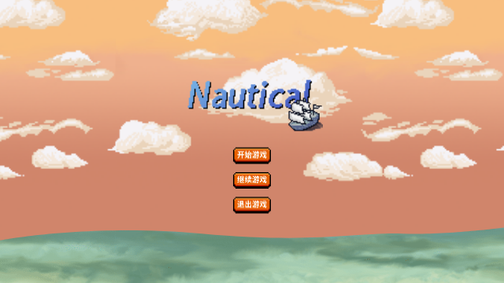
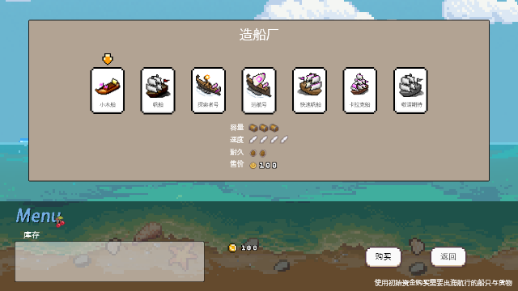
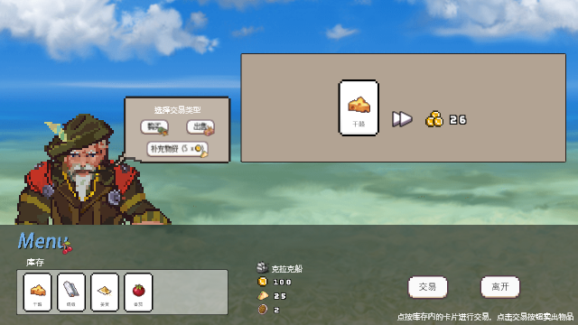
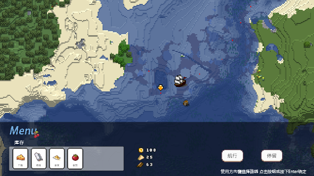
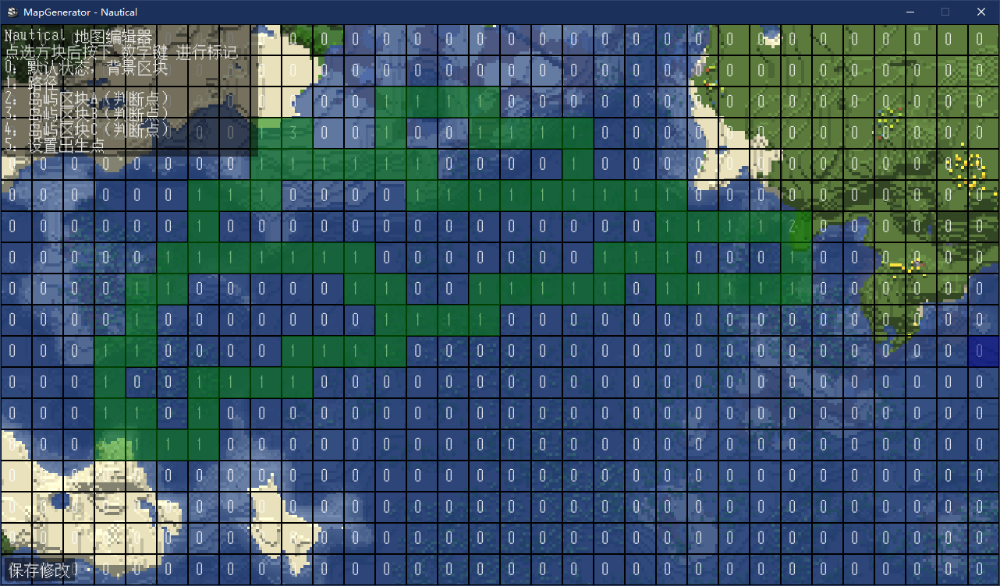

<center><h1>Nautical</h1></center>


很显然，这是一款基于 pygame 开发的游戏（屑作）

# 游戏玩法

购买船只，选择地图，航海，进行贸易

全程仅需鼠标左键操作

# 下载游玩

- with python
    
    ```bash
    git clone https://github.com/0ojixueseno0/Nautical.git
    cd Nautical
    pip install pygame
    python main.py
    ```

- without python
    
    下载 Release 中的 exe 版本

# 设计稿

## 开始页



## 造船厂



## 交易



## 航行



# 自定义游戏

## 地图编辑器



```bash
    python mapeditor.py [map]
```
[map] 为 地图编号，默认为 0

（release 版本）

```bash
    Nautical_MapEditor.exe [map]
```
（应该能用）

## 新增/修改地图

修改 _data/maps 下的 json 文件即可

> background : 背景图片路径
>
> block: 固定值 请勿修改
>
> spawn: 船只出生点（地图编辑器可以直接进行修改）
> 
> A/B/C.sell : 岛屿所出售的商品（为 items.json 中物品的 id）
> 
> A/B/C.saleable : 在岛屿中收购价高的商品（会对售价本身溢价）
> 
> A/B/C.unsaleable : 在岛屿中收购价低的商品（会低于售价本身）
>
> map.prop : 地图比例

## 新增/修改物品

_data/items.json 为所有物品的配置

> name : 物品名称
>
> price : 物品默认售价
>
> icon : 物品图标路径
>
> id : 物品id，不能重复

## 新增/修改船只

_data/ships.json 为所有船只配置

> name : 船只名称
>
> capacity : 船只容量（可以装载物品的数量）
>
> speed : 船只速度（回合内可以航行的次数）
>
> danger : 船只危险程度（越大越危险）
>
> durable : 船只耐久度（有多抗揍）
>
> max_durable : 船只最大耐久度（通常等于 durable）
>
> icon : 船只图标路径
>
> price : 船只售价

## 建议

建议只对配置进行修改，新增可能会导致渲染出现问题（懒得写兼容）